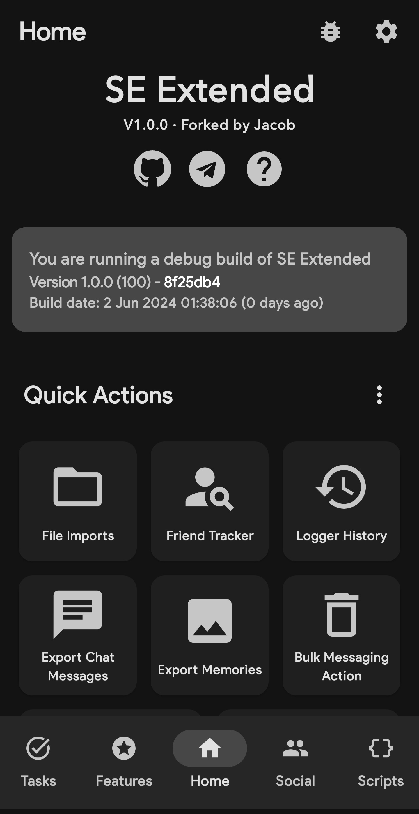
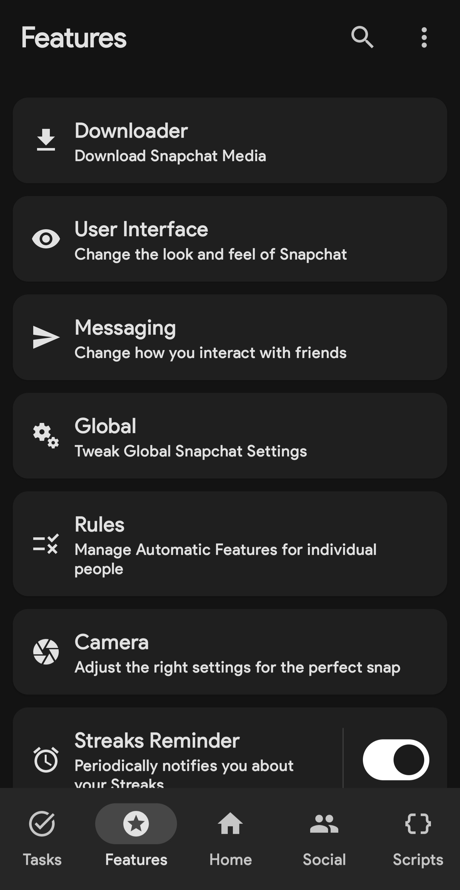
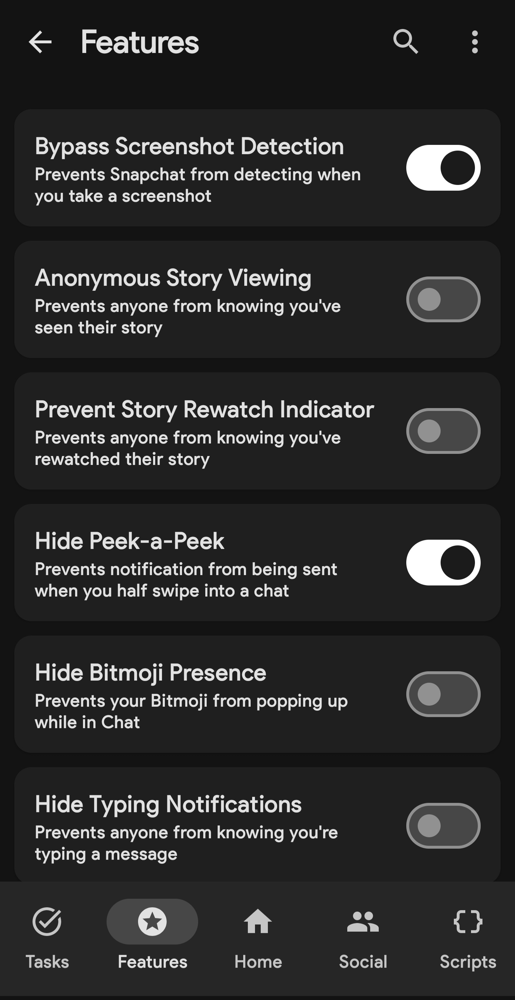
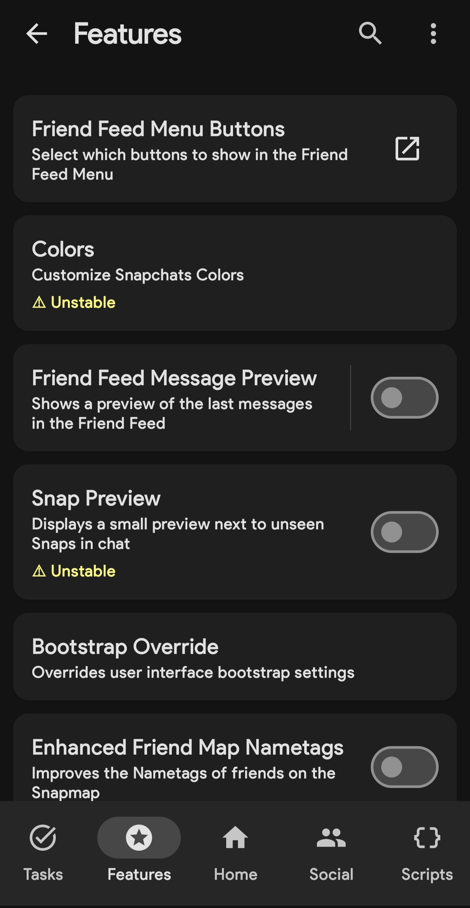
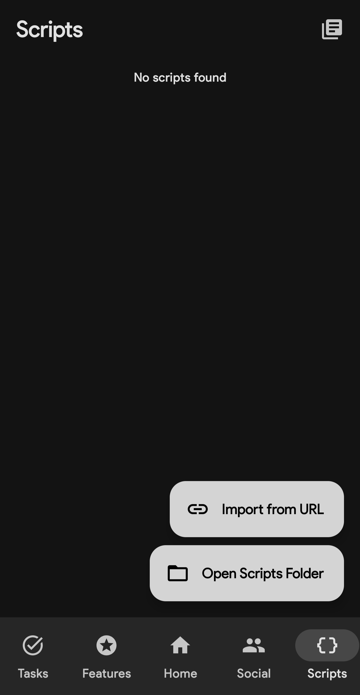
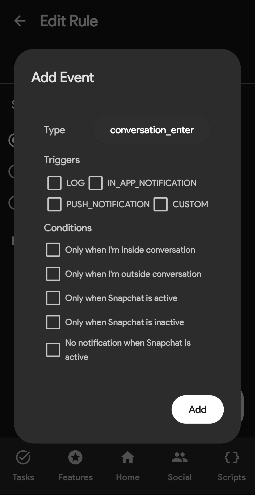

  
  
 

# SE Extended 
SE Extended is a fork from the [SnapEnhance app](https://github.com/rhunk/SnapEnhance) that uses the Xposed Framework to enhance your Snapchat experience.  
Please note that this project is currently in development, So bugs and crashes may occur. If you encounter any issues, we encourage you to report them. To do this simply visit our [issues](https://github.com/bocajthomas/SE-Extended/issues/new?assignees=&labels=bug&projects=&template=bug_report.yml&title=...) page and create an issue, make sure to follow the guidelines.

## 📱 Screenshots

## 📖 Main Features

  
⬇️ Media Downloader

  
  - `Save Folder`
  - `Auto Download Sources`
  - `Prevent Self Auto Download`
  - `Path Format`
  - `Allow Duplicate`
  - `Merge Overlays`
  - `Force Image Format`
  - `Force Voice Note Format`
  - `Download Profile Pictures`
  - `Opera Download Button`
  - `Download Context Menu`
  - `FFmpeg Options`
  - `Logging`
  - `Custom Path Format` 

  
📲 User Interface

  
  - `Friend Feed Menu Buttons`
  - `Auto Close Friend Feed Menu`
  - `Custom Theme`
  - `Friend Feed Message Preview` 
  - `Snap Preview`
  - `Bootstrap Override` (Default Home Tab & Persistent App Appearance)
  - `Enhance Friend Map Nametags`
  - `Prevent Message List Auto Scroll`
  - `Show Streak Expiration Info`
  - `Hide Friend Feed Entry`
  - `Hide Streak Restore`
  - `Hide Quick Add In Friend Feed`
  - `Hide Story Suggestions` 
  - `Hide UI Components` (Voice Record button, Call Buttons, Etc)
  - `Opera Media Quick Info`
  - `Old Bitmoji Selfie` 
  - `Disable Spotlight` 
  - `Hide Settings Gear`
  - `Vertical Story Viewer` 
  - `Message Indicators` 
  - `Stealth Mode Indicator` 
  - `Edit Text Override`

  

  
💬 Messaging

  
  - `Bypass Screenshot Detection` 
  - `Anonymous Story Viewing`
  - `Prevent Story Rewatch Indicator`
  - `Hide Peek-a-Peek`
  - `Hide Bitmoji Presence` 
  - `Hide Typing Notifications` 
  - `Unlimited Snap View Time`
  - `Auto Mark As Read` 
  - `Loop Media PlayBack`
  - `Disable Replay In FF`
  - `Half Swipe Notifier`
  - `Call Start Confirmation`
  - `Unlimited Conversation Pinning`
  - `Auto Save Messages` 
  - `Prevent Message Sending`
  - `Friend Mutation Notifier`
  - `Better Notifications` 
  - `Notifications Blacklist`
  - `Message Logger`
  - `Gallery Media Send Override`
  - `Strip Media Metadata`
  - `Bypass Message Retention Policy`
  - `Bypass Message Action Restrictions`
  - `Remove Groups Locked Status` 
 

  
🌎 Global

 
  - `Better Location`
  - `Snapchat Plus`
  - `Media Upload Quality` 
  - `Disable Confirmation Dialogs`
  - `Disable Metrics`
  - `Disable Story Sections`
  - `Block Ads`
  - `Disable Custom Tabs`
  - `Disable Permission Request`
  - `Disable Memories Snap Feed`
  - `Spotlight Comments Username` 
  - `Bypass Video Length Restriction`
  - `Default Video Playback Rate`
  - `Video Playback Rate Slider`
  - `Disable Google Play Services Dialogs`
  - `Default Volume Controls`
  - `Disable Telecom Framework`
  - `Hide Active Music`
  - `Disable Snap Splitting`

  
📜 Rules

  - `Stealth Mode`
  - `Auto Download`
  - `Auto Save`
  - `Auto Open Snaps`
  - `Unsaveable Messages`

  
📷 Camera

  
  - `Disable Camera`
  - `Immersive Preview`
  - `Black Photos` 
  - `Front Custom Frame Rate`
  - `Back Custom Frame Rate`  
  - `HEVC Recording`
  - `Force Camera Source Encoding`
  - `Custom Resolution`
  - `Override Front Resolution`
  - `Override Back Resolution`

⌛ Streaks Reminder

  
  - `Interval`
  - `Remaining Time`
  - `Group Notifications`

  
🧪 Experimental

  
  - `Native Hooks` (Custom Emoji Fonts, etc) 
  - `Spoof`
  - `Experimental Color Options`
  - `Convert Message Locally`
  - `Media File Picker`
  - `Story Logger`
  - `Call Recorder`
  - `Account Switcher`
  - `Better Transcript`
  - `Edit Messages`
  - `Context Menu Fix`
  - `COF Experiments`
  - `App Lock`
  - `Infinite Story Boost`
  - `My Eyes Only Passcode Bypass`
  - `No Friend Score Delay`
  - `Best Friend Pinning`
  - `End-to-End Encryption`
  - `Hidden Snapchat Plus Features`
  - `Custom Streaks Expiration Format`
  - `Add Friend Source Spoof`
  - `Prevent Forced Logout`

📄 Scripting

  - `Developer Mode`
  - `Module Folder`
  - `Auto Reload`
  - `Integated UI`
  - `Disable Log Anonymization`

👥 Friend Tracker

  - `Record Messaging Events`
  - `Allow Running In Background`
  - `Auto Purge`

## ⬇️ Download 
You will need to download SE Extended from ether the [Actions](https://github.com/bocajthomas/SE-Extended/actions/workflows/debug.yml) or our [CI Builds](https://t.me/SE_Extended_CI) Channel on telegram 

## ❓️Wiki
The [Wiki](https://github.com/bocajthomas/SE-Extended/wiki) is a place for all information regarding SE Extended.

## 💬 Contact 
Join our [Telegram Channel](https://t.me/SE_Extended) for Discussions, announcements, and releases!

## 💵 Donate
SE Extended will always be free and open source for everyone, If you like it, Consider [Donating](https://ko-fi.com/seextended)

## 🤝 Contributing 
Contributions are welcome! 
Thanks to everyone involved
- [suryadip2008](https://github.com/suryadip2008) (Translated: Bengali)
- [BogusMosquito77](https://github.com/BogusMosquito7) (Translated: Dutch)
- [Beingzain](https://github.com/Beingzain) (Translated: Urdu) 
- [comradekingu](https://github.com/comradekingu) (Translated: Norwegian Bokmål, Danish, Swedish)
- [scrodingerspet](https://github.com/schrodingerspet) (Translated: Japanese, Hindi)
- [MHaaning](https://github.com/MHaaning) (Translated: Danish)
- [vampskillz](https://github.com/vampskillz) (Translated: Italian)
- [jollindeerus](https://github.com/jollindeerus) (Translated: Finnish)

You can help translate SE Extended on [Hosted Weblate](https://hosted.weblate.org/projects/se-extended/se-extended/).

## ⭐ Star History
<a href="https://star-history.com/#bocajthomas/SE-Extended&Date">
 <picture>
   <source media="(prefers-color-scheme: dark)" srcset="https://api.star-history.com/svg?repos=bocajthomas/SE-Extended&type=Date&theme=dark" />
   <source media="(prefers-color-scheme: light)" srcset="https://api.star-history.com/svg?repos=bocajthomas/SE-Extended&type=Date" />
   
 </picture>
</a>

## 🔒 Privacy
We do not collect any user information. However, Please be aware that third-party libraries may collect data as described in their respective privacy policies.

  
Permissions

  
  - [android.permission.INTERNET](https://developer.android.com/reference/android/Manifest.permission#INTERNET)
  - [android.permission.REQUEST_IGNORE_BATTERY_OPTIMIZATIONS](https://developer.android.com/reference/android/Manifest.permission.html#REQUEST_IGNORE_BATTERY_OPTIMIZATIONS)
  - [android.permission.POST_NOTIFICATIONS](https://developer.android.com/reference/android/Manifest.permission.html#POST_NOTIFICATIONS)
  - [android.permission.SYSTEM_ALERT_WINDOW](https://developer.android.com/reference/android/Manifest.permission#SYSTEM_ALERT_WINDOW)
  - [android.permission.USE_BIOMETRIC](https://developer.android.com/reference/android/Manifest.permission#USE_BIOMETRIC)

## 🙏 Credits 
SE Extended Uses Some Third-party libraries, These Include 
  
  - [libxposed](https://github.com/libxposed/api)
  - [ffmpeg-kit-full-gpl](https://github.com/arthenica/ffmpeg-kit)
  - [osmdroid](https://github.com/osmdroid/osmdroid)
  - [coil](https://github.com/coil-kt/coil)
  - [Dobby](https://github.com/jmpews/Dobby)
  - [rhino](https://github.com/mozilla/rhino)
  - [rhino-android](https://github.com/F43nd1r/rhino-android)
  - [libsu](https://github.com/topjohnwu/libsu)
  - [colorpicker-compose](https://github.com/skydoves/colorpicker-compose)

## 📃 License
  
