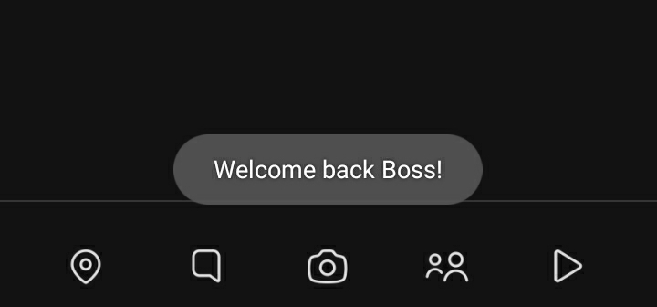
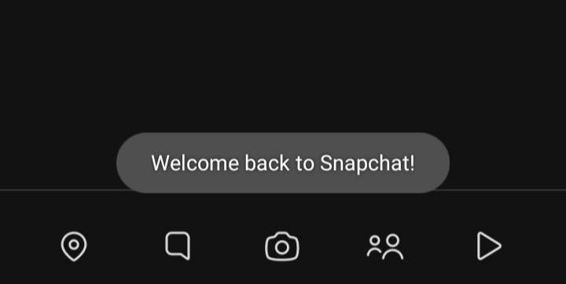
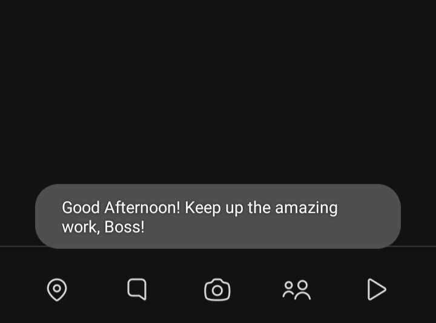
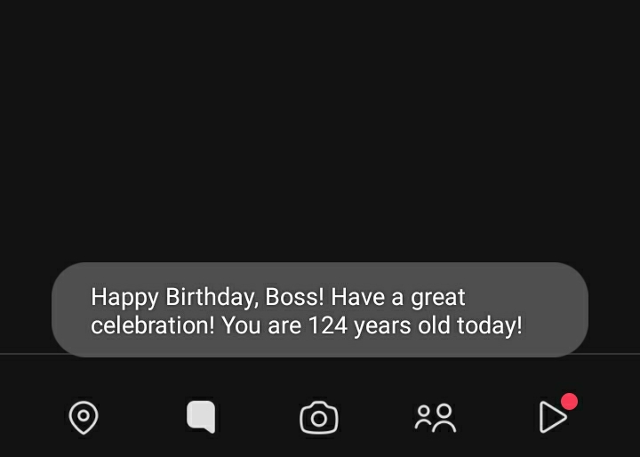

# SE Extended Scripts Repository

Welcome to the SE Extended Scripts Repository! This repository contains various scripts designed to enhance your Snapchat experience by tweaking the user interface and adding custom functionalities.

## Table of Contents

- [Custom Toast](#custom-toast)
- [Greetings Toast](#greetings-toast)
- [Motivation Dialogs](#motivation-dialogs)
- [Scheduled Messages (Work in Progress, Incomplete)](#scheduled-messages-work-in-progress-incomplete)
- [Screenshots](#screenshots)
- [How to Use](#how-to-use)
- [Troubleshooting](#troubleshooting)

## Custom Toast

- **Name:** custom_toast
- **Version:** 1.1
- **Last Updated:** June 11, 2024
- **Author:** Gabriel Modz, Jacob Thomas & Jimothy
- **Description:** A Script that shows a custom toast on the startup of Snapchat.

To download the latest version of the script, click the link below:

[Download Custom Toast Script v1.1](https://github.com/suryadip2008/SE-Deluxe/blob/c8505ae07ff924b32093c19cb79cfbb3d46c771d/Scriptdev/CustomToastv1.1.js)

## Greetings Toast

- **Name:** greetings_toast
- **Version:** 2.0
- **Last Updated:** July 16, 2024
- **Author:** Suryadip Sarkar
- **Description:** A Script that shows a greetings toast on the startup of Snapchat.

To download the latest version of the script, click the link below:

[Download Greetings Toast Script v2.0](https://github.com/suryadip2008/SE-Deluxe/blob/c8505ae07ff924b32093c19cb79cfbb3d46c771d/Scriptdev/greetings_toast_v2.0.js)

## Motivation Dialogs

- **Name:** motivation_dialogs
- **Version:** 2.0
- **Last Updated:** July 16, 2024
- **Author:** Suryadip Sarkar & Jacob Thomas
- **Description:** A Script that shows a random motivation quote dialog on the startup of Snapchat.

To download the latest version of the script, click the link below:

[Download Motivation Dialogs Script v2.0](https://github.com/suryadip2008/SE-Deluxe/blob/aac4b328ce57a3ef998c66b79b037410c506c63e/Scriptdev/motivation_dialogs_v2.0.js)

## Scheduled Messages (Work in Progress, Incomplete)

- **Name:** scheduled_message
- **Version:** 0.1
- **Last Updated:** April 26, 2024
- **Author:** Jacob Thomas
- **Description:** A Script That Allows For Scheduling Messages.

To download the latest version of the script, click the link below:

[Download Scheduled Messages Script v0.1](https://github.com/bocajthomas/SE-Extended/blob/ce45fa592734a1c4a8f87da05a8ccc60d63fbff2/Scriptdev/ScheduledMessage.js)

## Screenshots

Below are some screenshots demonstrating the script in action:

- ## Custom Toast:
  
  

  
  

- ## Greetings Toast:
  
  

  
  

- ## Motivation Toast:
  
  

  
  

## How to Use

Follow these steps to install and use the script:

1. **Download the Script:**
   Click the download link above and then click on the three dots icon on the top right corner and then click on Download.

2. **Installation:**

   - Copy the script to your Scripts folder.

3. **Enable the Script:**

   - Open SE Extended.
   - Navigate to the 'Scripts' section and enable the script.

4. **Configuration:**

   - Go to the script settings to customize options like custom toast, username, date of birth, etc.

## Troubleshooting

### FAQs

- **Script Not Working:**
  - Ensure the script is placed in the correct folder.
  - Check if the script is enabled in SE Extended.

- **Toasts not showing up sometimes**
  - Scripts like custom_toast.js, greetings_toast.js, etc which are based on toasts require Snapchat to be closed completely then opened. If you have just pressed the home button to exit Snapchat and reopened Snapchat again, the toast might not show up. You also need to clear Snapchat from the recents menu or exit it properly in order for the toast to show up.

For any furthur queries, refer to the official telegram community : https://t.me/SE_Extended_Chat
